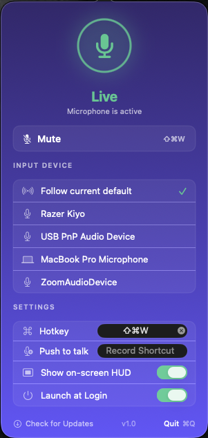

# muteapp

<p align="center">
  
</p>

Tiny native macOS menu-bar app that toggles your microphone with a global hotkey. A free, Apple-Silicon-native replacement for the abandoned [mutekey](https://github.com/cdzombak/mutekey).

- Global hotkey (default ⌃⌥⌘M, configurable)
- Menu-bar icon turns red when muted
- On-screen HUD that flashes briefly when you toggle
- Optional sound effects on mute/unmute (off by default)
- Mutify-inspired popover with live input-level meter, device picker, and inline settings
- Per-device targeting — control a specific mic, or always follow whatever's the system default
- Launch at login

## Build & install

Requires full Xcode (not just Command Line Tools) and `xcodegen`.

```fish
# 1) generate the .xcodeproj
nix-shell -p xcodegen --run "xcodegen generate"

# 2) (optional) regenerate the icon PNGs from tools/icon.svg
nix-shell -p librsvg --run "tools/build-icon.sh"

# 3) build Release and copy to /Applications
DEVELOPER_DIR=/Applications/Xcode.app/Contents/Developer xcodebuild \
    -project muteapp.xcodeproj -scheme muteapp -configuration Release \
    -derivedDataPath build CODE_SIGN_IDENTITY=- build
cp -R build/Build/Products/Release/muteapp.app /Applications/
open /Applications/muteapp.app
```

A microphone icon appears in the menu bar. Left-click to open the popover, right-click for a tiny Toggle/Quit menu.

## Running someone else's prebuilt copy

Because this isn't notarized (no $99/yr Developer Program), Gatekeeper will refuse to launch a downloaded `.zip` build with the usual *"unidentified developer"* dialog. You have two options:

```fish
# right-click → Open is the click-through path (works once)
open /Applications/muteapp.app

# or drop the quarantine attribute up front
xattr -dr com.apple.quarantine /Applications/muteapp.app
```

This is a one-time step per install. Building locally from source avoids it entirely.

## Why no Sparkle?

Sparkle handles "new version available, download and install" cleanly, but it doesn't fix Gatekeeper for an unsigned/free-cert app — downloaders still need the right-click→Open dance. For a personal tool the cost of adding Sparkle outweighs the benefit. Instead the popover footer has a *Check for Updates* link that opens the GitHub Releases page in your browser.

## Cutting a release

```fish
tools/release.sh
# → dist/muteapp-1.0.zip + SHA256
```

Then create a GitHub Release and attach the zip.

## Architecture

| File | Role |
|---|---|
| `main.swift` | Entry point — sets `.accessory` activation policy, runs `NSApplication`. |
| `AppDelegate.swift` | `NSStatusItem`, left/right click split, HUD on mute change. |
| `AudioController.swift` | CoreAudio: mute property, volume fallback, device enumeration, listeners. |
| `HotkeyController.swift` | `KeyboardShortcuts` global hotkey → `AudioController.toggle()`. |
| `PopoverView.swift` | SwiftUI popover (mic glyph, level meter, device list, inline settings). |
| `PopoverController.swift` | `NSPopover` host. |
| `LevelMeter.swift` | `AVAudioEngine` input tap → smoothed RMS for the meter. |
| `HUDController.swift` | Borderless `NSPanel` that flashes the muted/live glyph centered on screen. |
| `SoundController.swift` | Plays bundled `Resources/Sounds/{mute,unmute}.wav` on mute change when sound effects are enabled. |
| `Theme.swift` | Gradient colors, accents. |
| `Settings.swift` | UserDefaults-backed prefs (target mode, device UID, restore levels, HUD enabled, sound enabled). |

Mute primitive prefers `kAudioDevicePropertyMute` on the input scope; for devices that don't expose it (some USB mics), the app drives `kAudioDevicePropertyVolumeScalar` to 0 and restores the prior level on unmute.

## License

MIT — see `LICENSE`.
